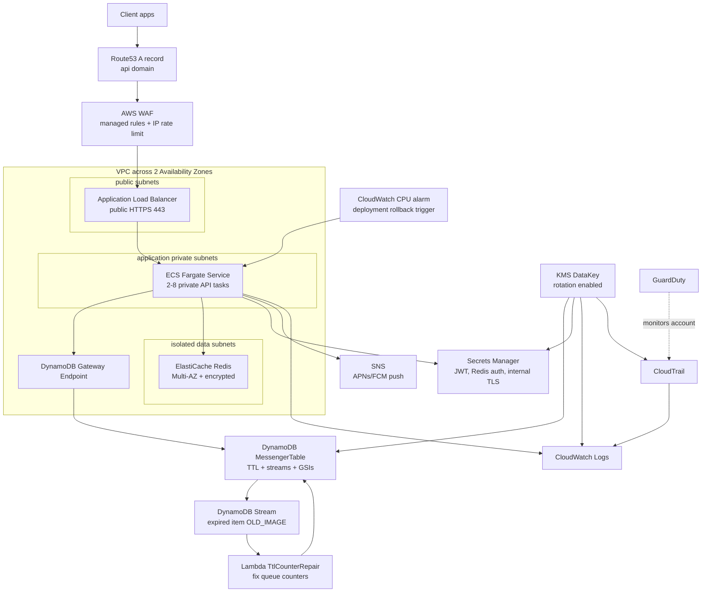

# Private Messenger AWS Stack

## File Map

- `src/messenger-stack.ts`: top-level wiring and stack outputs.
- `src/dynamodb.ts`: KMS key, DynamoDB table, indexes, TTL counter repair Lambda.
- `src/network.ts`: VPC, subnets, DynamoDB endpoint, security groups.
- `src/redis.ts`: Redis auth secret, subnet group, ElastiCache replication group.
- `src/ecs.ts`: ECS cluster, Fargate task/service, Docker image, secrets, logs, autoscaling.
- `src/load-balancer.ts`: ALB, public TLS listener, target group, Route53 alias record.
- `src/security.ts`: WAF, CloudTrail, GuardDuty, deployment rollback alarm.
